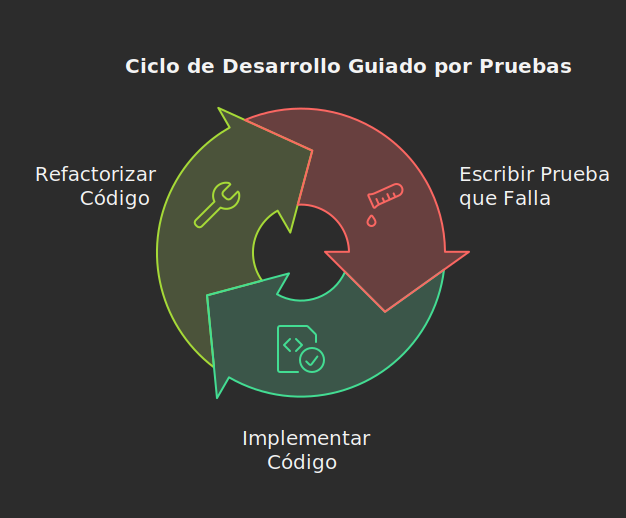

### Pruebas Unitarias y Pruebas de Mutación: Asegurando la Calidad de tu Código

#### Introducción

En el mundo del desarrollo de software, la calidad es un factor crucial. Asegurar que el código funcione correctamente y cumpla con las expectativas del usuario es fundamental para el éxito de cualquier proyecto. Las **pruebas unitarias** y las **pruebas de mutación** son dos técnicas esenciales que nos ayudan a lograr este objetivo. Este blog tiene como objetivo explicar estos conceptos de manera clara y concisa, destacando su importancia y ofreciendo guías prácticas para su implementación.

#### Desarrollo

##### Conceptos Clave

*   **Pruebas Unitarias**: Son pruebas automatizadas diseñadas para verificar el funcionamiento de las unidades de código más pequeñas, como funciones o métodos. Estas pruebas se centran en validar que cada componente del sistema funcione como se espera, respondiendo correctamente, fallando cuando debe fallar y cómo debe fallar. Una prueba unitaria es un bloque de código con entradas, una entidad a probar y salidas.
*   **Mocks**: Los mocks son objetos simulados que se utilizan en las pruebas unitarias para aislar el código que se está probando de sus dependencias externas. Un mock simula el comportamiento de un objeto real, permitiendo al desarrollador verificar la lógica interna de la unidad de código sin depender de otros componentes.
*   **Pruebas de Mutación**: Son pruebas que evalúan la efectividad de las pruebas unitarias, introduciendo pequeñas modificaciones (mutaciones) en el código fuente. Si las pruebas unitarias están bien diseñadas, deberían detectar estas mutaciones y fallar. Si las pruebas no fallan, es una indicación de que la prueba unitaria no es lo suficientemente robusta.

##### Teoría

*   **Principios FIRST:** Las pruebas unitarias deben ser **rápidas**, **independientes**, **repetibles**, **autovalidadas** y **oportunas**.
*   **Patrón AAA (Arrange-Act-Assert):** Un estándar para estructurar las pruebas unitarias, dividiéndolas en tres secciones:
    *   **Arrange (Organizar):** Se instancian objetos y se establecen valores.
    *   **Act (Actuar):** Se invoca el método que se va a validar.
    *  **Assert (Afirmar):** Se verifica que el resultado obtenido sea igual al esperado.

*   **TDD (Test Driven Development)**:  El desarrollo guiado por pruebas implementa las pruebas antes del código principal. Tiene un ciclo muy bien definido que se muestra en la siguiente imagen: RED (Escribe una prueba que falle), GREEN (Implementa el código para que la prueba pase), REFACTOR (Mejora el código que acabas de escribir verificando que el código escrito pase la prueba implementada).

*   **Cobertura de Código:** Indica qué partes del código han sido ejecutadas por una prueba unitaria. Un alto porcentaje de cobertura no garantiza la calidad de las pruebas.
*   **Pruebas de Mutación y su Relación con la Cobertura:** Las pruebas de mutación complementan las métricas de cobertura al asegurar que las pruebas unitarias no solo ejecuten el código, sino que también verifiquen que su comportamiento es correcto. El objetivo es que las mutaciones en el código sean detectadas por las pruebas.

##### Aplicaciones Prácticas

*   **Desarrollo de Software:** Las pruebas unitarias son fundamentales en el desarrollo de cualquier aplicación, ya sea web, móvil o de escritorio. Se utilizan para validar la lógica del negocio y asegurar la calidad del código.
*   **Integración Continua:** Las pruebas unitarias se ejecutan automáticamente como parte del proceso de integración continua, ayudando a detectar errores de manera temprana.
*  **Refactorización**: Las pruebas unitarias sirven como documentación del código. También facilitan la refactorización porque si los tests siguen pasando despues de la refactorización, es indicativo de que no se introdujeron nuevos errores.
*  **Ejemplos de Pruebas Unitarias**:
  *   Validar el resultado de una función matemática.
  *   Probar la lógica de un servicio que procesa datos.
  *   Asegurar el comportamiento de una clase que interactúa con una base de datos (utilizando mocks).
*   **Ejemplos de Pruebas de Mutación**:
    *   Cambiar un operador aritmético en una función (por ejemplo, de suma a resta) para verificar que las pruebas unitarias detecten el cambio.
    *   Modificar una condición lógica para asegurar que las pruebas cubran todos los casos posibles.
    *   Remover elementos de una lista para verificar que las pruebas unitarias evalúen el manejo correcto de listas vacías o parcialmente llenas.

##### Material de Apoyo

*   **Videos Explicativos:**
    *   [Aprende a TRIANGULAR en TDD para pasar de rojo a verde #TestDrivenDevelopment](https://www.youtube.com/watch?v=9xY3Qf1h17M)
    *   [Test de Controladores en Spring Boot con Mockito y JUnit usando MockMvc (WebMvcTest)](https://www.youtube.com/watch?v=8Ea15xK_Bxo)
    *   [Test unitario con Spring Boot, Mockito y JUnit 5 | 1 - Introducción y presentación del proyecto](https://www.youtube.com/watch?v=m8G7iG-K7Hk)

*   **Artículos y Tutoriales:**
    *   [Mutation Test en Java: Tutorial y ejecución](https://medium.com/pragma/mutation-test-en-java-tutorial-y-ejecuci%C3%B3n-1164789b5938)
    *   [¿Qué problema hay en utilizar TDD?](https://itdo.com/blog/que-problema-hay-en-utilizar-tdd/)

*   **Otros Recursos:**
    *   [Testing on the Toilet](https://testing.googleblog.com/search/label/testing%20on%20the%20toilet)

#### Conclusión

Las **pruebas unitarias** y las **pruebas de mutación** son herramientas esenciales para asegurar la calidad del software. Las pruebas unitarias permiten verificar el correcto funcionamiento de las unidades de código, mientras que las pruebas de mutación ayudan a medir la efectividad de esas pruebas. Implementar estas prácticas no solo reduce los errores en producción, sino que también mejora la calidad y la mantenibilidad del código. Adoptar una cultura de pruebas en el desarrollo de software es una inversión valiosa que trae beneficios a largo plazo.
